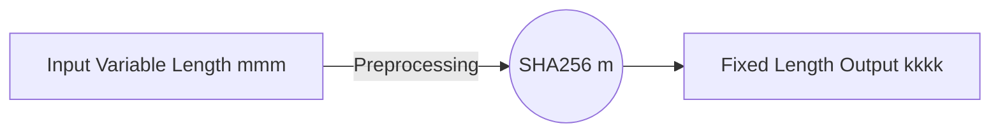

# Secure Hash Algorithim 

This repo contains an implementation of the SHA 256 algorithim written in the C programming language. 


The code was written in accordance to the the Secure Hash Algorthim as specified by the  US government in the following [doccument]([https://www.nist.gov/publications/secure-hash-standard](https://www.nist.gov/publications/secure-hash-standard)).


> The hash algorithms specified in this Standard are called secure because, for a given algorithm, it is computationally infeasible 1) to find a message that corresponds to a given message digest, or 2) to find two different messages that produce the same message digest. Any change to a message will, with a very high probability, result in a different message digest. This will result in a verification failure when the secure hash algorithm is used with a digital signature algorithm or a keyed-hash message authentication algorithm.

# Executing the Program 
### Prerequisites
1. C compiler (GCC)
    - Unix Systems: https://gcc.gnu.org/install/
    - Windows, Systems  www.mingw.org

###  Installation
1.  Git Clone this repository to your local machine
	```git
	git clone https://github.com/DaireNiC/SHA-256
	```
2. Navigate to directory containing repo
	``` 
	cd SHA-256
	```
3. Compile the C file
	```
	gcc -o sha256 ./sha.c
	```
4. Run the executable with file input
	```
	./sha256.exe <file-name>
	```

# SHA 256
SHA 256 is an iterative algorithim. The input is alterted in such a way that the output from the last iteration is the input to the next iteration. Therefore, any slight change to the input results in a drastically different output, thus increasing the security of the algorithim.





Keywords                           | In Context of SHA Specification|
|----------------|-------------------------------|-----------------------------|
Message Digest|`Series of fixed length hex characters`            
|ROTR|`Rotate Bits Right (circular right shift)`|
|ROTL|`Rotate Bits Left(circular left shift)`|
|SHR|`Shift Bits Right`|


 The secure hashing algorithim can be described in two stages:

 1. Preprocessing the message
 2. Hash Computation 
## Preprocessing 
-  SHA is designed to work with blocks of 512 bits. In the event of an input not being a multiple of 512, preprocessing is preformed. 
- Padding is used to ensure each chunk of input is exactly 512 bits in length before being input to that hashing algorthim.

### Padding Function 

```c
int nextmsgblock(FILE *msgf, union msgblock *M, enum status *S, uint64_t *nobits) {

  (1) Reads in file
  (2) Chops into 512 bit chunks
  (3) Adds a 1 bit to signify end of file input
  (4) Adds 0 for Padding if needed 
  (5) Adds 64 bits to indicate length of original file
} 

```

##  Hash Computation 

```c

void sha256(FILE *msgf) {

  (1) Break message into 512-bit chunks and then into 16 x 32 bit words
  (2) Set Hash output to H constants initially
  (3) Create new values for working variables
  (4) Add up all the working variables to each hash 

  // hash values constants come from (section 5.3.3) of SHA Spec
  uint32_t H[8] = {
    0x6a09e667,
    0xbb67ae85,
    0x3c6ef372,
    0xa54ff53a,
    0x510e527f,
    0x9b05688c,
    0x1f83d9ab,
    0x5be0cd19,
  };
} 

```
### ROTR Rotate Right
- Shifts bits to the right, any bits that fall off come around to the front.
### SHR Function 
- Shifts bits to the right . Any bits lost are replaced by a 0 bit to the front. 


## Extras relevant to Project
### Consistent  Work
- Weekly commits to repo
- Initially focused on research (links doccumented below)
### Testing
- Test file(test.txt) included in the repo.
- Contains verified hash value from [https://www.di-mgt.com.au/sha_testvectors.html](https://www.di-mgt.com.au/sha_testvectors.html "https://www.di-mgt.com.au/sha_testvectors.html"). 
### Inline Functions
- To optimize the hashing algorithim I opted to include inline funcitons for the bitwise operations. 
- This involved researching how to implement Inline functions in C & also raised the question of when to use Macros vs inline functions.
### Known Issues 
- As of now, this implementation of the SHA256 is not entirely correct. The test output does not match sample verified output examples. This is most likely due to BIg/Little Endian processing errors. 

# Research Resources
-  VIdeo tutorials provided by Dr.Ian McLoughlin were the primary resource for this project.


### Inline Functions in C
- https://www.greenend.org.uk/rjk/tech/inline.html
- https://stackoverflow.com/questions/785145/one-line-functions-in-c
### Macros in C
- [https://gcc.gnu.org/onlinedocs/cpp/Macros.html](https://gcc.gnu.org/onlinedocs/cpp/Macros.html)
#### Macros vs Inline Functions
- [http://www.embhack.com/macro-vs-inline-functions/](http://www.embhack.com/macro-vs-inline-functions/)
- [https://stackoverflow.com/questions/13375288/inline-function-vs-macro-function](https://stackoverflow.com/questions/13375288/inline-function-vs-macro-function)
### Bitwise Operations in C 
- https://www.geeksforgeeks.org/bitwise-operators-in-c-cpp/
- [https://www.youtube.com/watch?v=jlQmeyce65Q](https://www.youtube.com/watch?v=jlQmeyce65Q)
- https://www.programiz.com/c-programming/bitwise-operators
